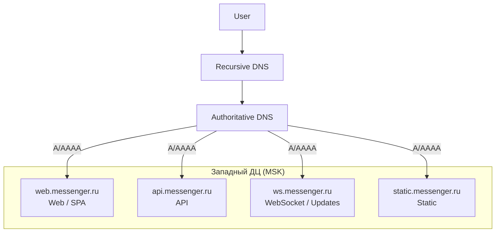
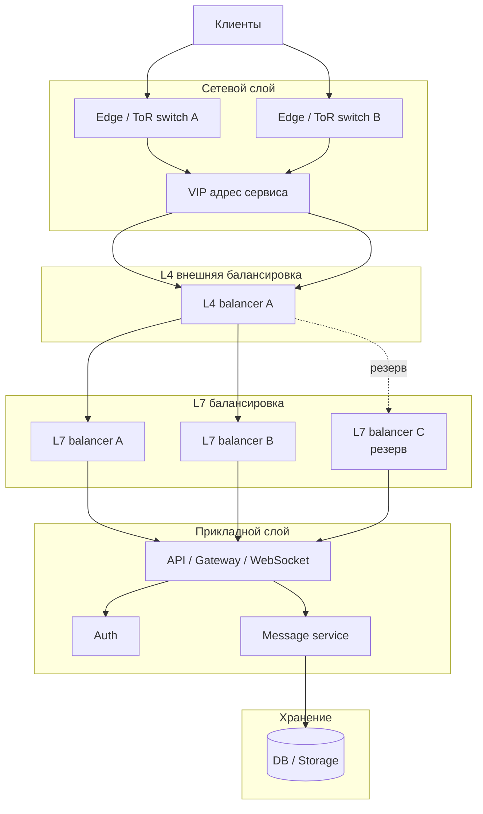
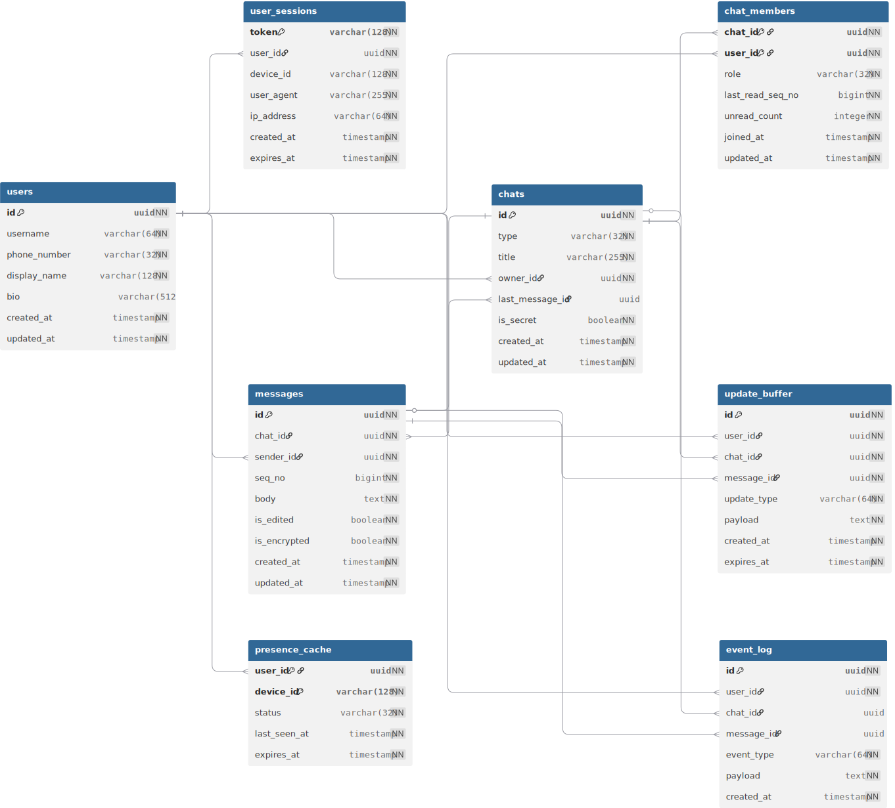
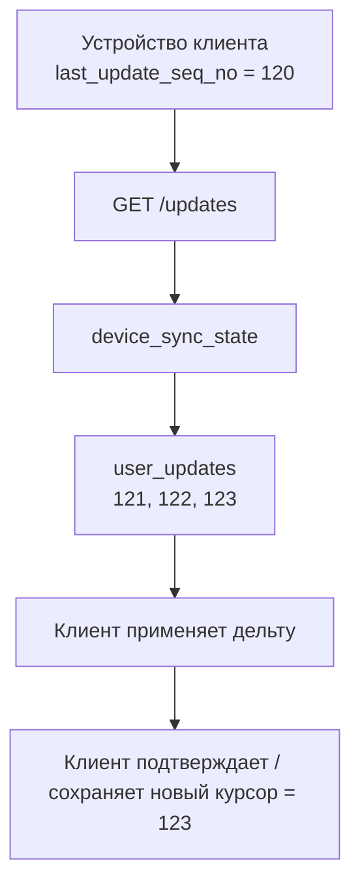
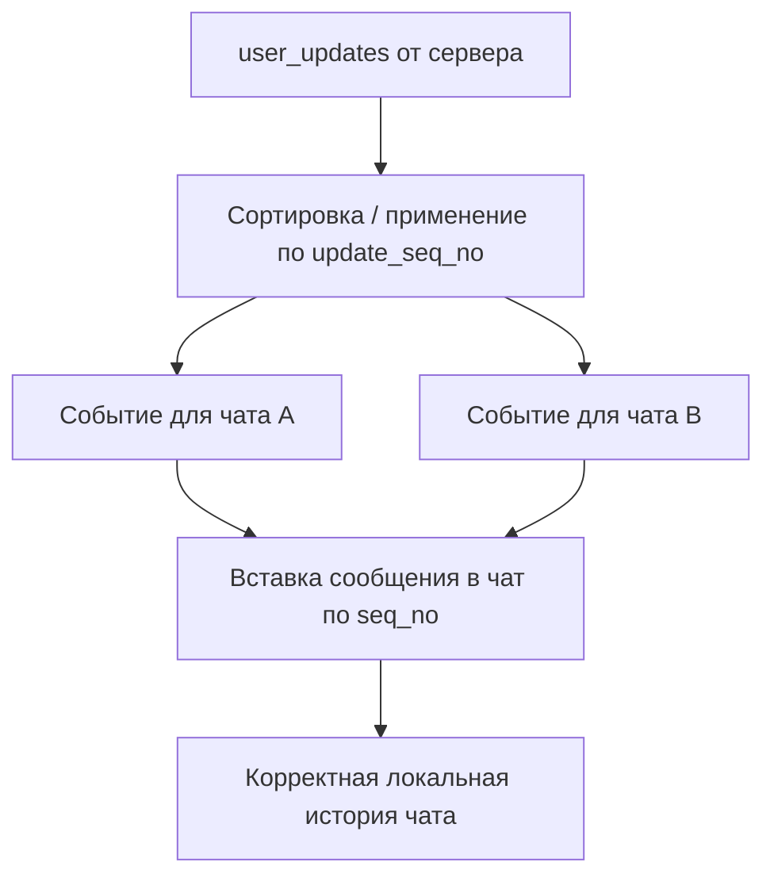

# Высоконагруженный мессенджер-клон Telegram

---
## Содержание

- [Высоконагруженный мессенджер-клон Telegram](#высоконагруженный-мессенджер-клон-telegram)
	- [Содержание](#содержание)
	- [Основная часть](#основная-часть)
		- [1. Тема и целевая аудитория](#1-тема-и-целевая-аудитория)
			- [Функционал MVP](#функционал-mvp)
			- [Аналоги на рынке](#аналоги-на-рынке)
			- [Глобальная аудитория Telegram](#глобальная-аудитория-telegram)
				- [Глобальное распределение по полу](#глобальное-распределение-по-полу)
				- [Глобальное распределение по возрасту](#глобальное-распределение-по-возрасту)
			-  [Аудитория Telegram в России](#аудитория-telegram-в-россии)
			- [География и размер](#география-и-размер)
		- [2. Расчёт нагрузки](#2-расчёт-нагрузки)
			- [Продуктовые метрики](#продуктовые-метрики)
				- [Допущения](#допущения)
			- [Технические метрики](#технические-метрики)
				- [Сетевой трафик в день](#сетевой-трафик-в-день)
				- [Запросы в секунду](#запросы-в-секунду)
				- [Расчеты](#расчеты)
		- [3. Глобальная балансировка нагрузки](#3-глобальная-балансировка-нагрузки)
			- [Функциональное разбиение по доменам](#функциональное-разбиение-по-доменам)
			- [Расположение дата-центров](#расположение-дата-центров)
			- [Распределение запросов по дата-центрам](распределение-запросов-по-дата-центрам)
			- [Схема DNS балансировки](#схема-dns-балансировки)
			- [Схема Anycast балансировки](#схема-anycast-балансировки)
			- [Механизм регулировки трафика между дата-центрами](#механизм-регулировки-трафика-между-дата-центрами)
		- [4. Локальная балансировка нагрузки](#4-локальная-балансировка-нагрузки)
			- [Механизм резервирования](#механизм-резервирования)
			- [Расчёт количества L7-балансировщиков](#расчёт-количества-l7-балансировщиков)
			- [Общее количество балансировщиков](#общее-количество-балансировщиков)
			- [Схема балансировки нагрузки](#схема-балансировки-нагрузки)
		- [5. Логическая схема БД](#5-логическая-схема-бд)
			- [Логическая схема](#логическая-схема)
			- [Описание таблиц](#описание-таблиц)
			- [Размеры данных и нагрузки на чтение с записью](#размеры-данных-и-нагрузки-на-чтение-с-записью)
			- [Требования к консистентности](#требования-к-консистентности)
			- [Особенности распределения нагрузки по ключам](#особенности-распределения-нагрузки-по-ключам)
		- [6. Физическая схема Баз Данных](#6-физическая-схема-баз-данных)
			- [Физические проекции данных](#физические-проекции-данных) 
			- [Физическая схема](#физическая-схема)
			- [Выбор СУБД по таблицам](#выбор-субд-по-таблицам)
			- [Индексы](#индексы)
			- [Денормализация](#денормализация)
			- [Шардирование относительно нагрузки](#шардирование-относительно-нагрузки)
			- [Клиентские библиотеки и интеграции](#клиентские-библиотеки-и-интеграции)
			- [API-вызов в СУБД](#api-вызов-в-субд)
		- [7. Алгоритмы](#7-алгоритмы)
			- [Общее описание алгоритмов](#общее-описание-алгоритмов)
				- [Delta Synchronization](#delta-synchronization)
				 - [Ordered Merge по update_seq_no и seq_no](#ordered-merge-по-update_seq_no-и-seq_no)
	- [Список источников](#список-источников)

---
## Основная часть

### 1. Тема и целевая аудитория

**Тип сервиса :**  Мессенджер-клон Telegram для русского рынка.
#### Функционал MVP

1.  Отправка/прием текстовых сообщений.
2. Групповые чаты и каналы (общение больших групп пользователей).
3. Секретные чаты (конфиденциальность сообщений).
4.  Синхронизация сообщений в облаке - все чаты хранятся на сервере (доступны с любого устройства).

#### Аналоги на рынке

- Telegram. Глобальная месячная аудитория ~1,000 млн MAU [^1] и ~500 млн DAU [^1] на 2026 г.
- WhatsApp. Глобальная месячная аудитория ~3,000 млн MAU[^2] и ~600 млн DAU [^10] на 2024 г.

#### Глобальная аудитория Telegram

- **MAU (месячные активные пользователи)**: ~1 000 млн пользователей [^1].
- **DAU (дневные активные пользователи)**: ~500 млн пользователей [^1].
- Страны: Индия, Бразилия, Мексика, Южная Африка, Испания, Италия, Германия, Франция, Россия [^1].
##### Глобальное распределение по полу

| Пол     | Значение (%) |
| ------- | ------------ |
| Мужской | 58.6 % [^4]  |
| Женский | 41.4 % [^4]  |
##### Глобальное распределение по возрасту

| Группа  | Значение (%) |
| ------- | ------------ |
| 13 - 17 | 6.4% [^5]    |
| 18 - 24 | 18.8% [^5]   |
| 25 - 34 | 29.4% [^5]   |
| 35 - 44 | 23.8% [^5]   |
| 45 - 54 | N/A          |
| 55+     | N/A          |

#### Аудитория Telegram в России

- **MAU**: ~34,4 млн человек в месяц. [^3]
- **DAU**: ~17 млн человек в день (При принятом соотношении DAU/MAU ≈ 50%)
- За оценки по полу и возрасту возьмем глобальные метрики.

#### География и размер

**Основной рынок**: Россия. 
Это ~145 млн населения. 34,4 млн MAU Telegram в РФ соответствует примерно 24% населения. Масштабный рынок с высокой нагрузкой.

---
### 2. Расчёт нагрузки
#### Продуктовые метрики

| Метрика                                          | Расшифровка                                                                         | Значение                        | Комментарии       |
| ------------------------------------------------ | ----------------------------------------------------------------------------------- | ------------------------------- | ----------------- |
| MAU                                              | Активных пользователей<br>в месяц                                                   | ~34,400,000 человек в месяц     | нет               |
| DAU                                              | Активных пользователей<br>в день                                                    | ~17,200,000 человек в день      | нет               |
| DSU (Daily <br>Sessions per User)                | Открытых сессий в день <br>на пользовтеля                                           | 21 сессия в день [^6]           | см. допущение № 1 |
| DATSU (Daily Average <br>Time Spent per User)    | Среднее время в день, <br>которое проводит пользователь в приложении                | 41 минута в день [^6]           | см. допущение № 1 |
| DMR (Daily Messages Received)                    | **Полученных** сообщений в день на всех пользователей                               | ~5,160,000,000 сообщений в день | см. допущение № 2 |
| DAMRU (Daily Average Messages Received per User) | Среднее количество **получаемых** сообщений <br>в день на одного <br>пользователя   | ~296.5<br>сообщений в день      | см. допущение № 3 |
| DMS (Daily Messages Send)                        | **Отправленных** сообщений в день на всех пользователей                             | ~802,724,000 сообщений в день   | cм. допущение № 4 |
| DAMSU (Daily Average Messages Sens per User)     | Среднее количество **отправленных** сообщений <br>в день на одного <br>пользователя | ~46.67 <br>сообщений в день     | cм. допущение № 4 |
| MMC (Median Messages Character)                  | Медианное количество символов в 1 сообщении                                         | 136 [^8]                        | нет               |
| DASU (Daily Average Storage per User)            | Среднее количество памяти, которое занимает 1 пользователь в день                   | ~24.79 КБ                       | cм. допущение № 5 |
##### Допущения
1. Далее будут метрики, которые относятся к России. Если конкретно по России нет той или иной метрики, я предполагаю, что глобальная метрика будет иметь похожие значения и в РФ.
2. Данные по сообщениям в день старые (от 2016) [^7]. Но в них говорится, что получается 15,000,000,000 сообщений в день, при глобальном MAU 100,000,000 (на 2016) и DAU 50,000,000[^7] (мы допускаем соотношение DAU/MAU = 0.5, как в 2026). 
   Предположим, что тенденция на получение сообщений не снизилась. Мое предположение базируется на широком распространении ботов и развития большого количества сообществ в Telegram. Учитывая, что глобальное MAU теперь 1,000,000,000 и DAU 500,000,000[^1]. Полученных сообщений в день должно быть 150,000,000,000. Посчитаем коэффициент соотношения глобального DAU к Российскому DAU: $500,000,000 ÷ 17,200,000 = 29.07$. 
   Количество получаемых сообщений в день на всех пользователей России: $150,000,000,000 ÷ 29.07 =\ \sim5,160,000,000$ 
3. Учитывая, что пользователем может быть Бот, через которого проходит огромное количество сообщений.
4. Telegram не публикует количество отправленных сообщений в день, поэтому сделаем предположение, что их столько же, как и в WhatsApp. При ~3,000,000,000 MAU[^2] и ~600,000,000 DAU [^10] и более ~40,000,000,000 сообщений в день [^11].  
   Получаем примерно: $40,000,000,000 ÷ 600,000,000 =\ \sim66.67$ сообщений в день.
   Но учтем, что Telegram больше, чем мессенджер и люди тратят 30% времени **только** [^12] на чтение каналов, получим оценку: $66.67 \times (1 \times 0.30) =\ \sim 46.67$ в день на одного пользователя.
   Или в день по всем пользователям России получим $46.67 \times 17,200,000  =\ \sim 802,724,000$.
5.  Размер одного сообщения: $136 \times 4 = 544$ байта, так как мы берем за основу кодировку UTF-8 с поддержкой русских символов и смайликов [^9]. И соответственно, хранилища, нужного в день на одного пользователя: $544 \times 46.67 = 25,387$ байт или  $\sim 24.79$  КБ.

#### Технические метрики
##### Сетевой трафик в день

| Тип трафика                          | Суточный объём (ГБ/сут) | Средняя скорость (Гбит/с) | Пиковая скорость (Гбит/с) | Расчеты   |
| ------------------------------------ | ----------------------- | ------------------------- | ------------------------- | --------- |
| Исходящие <br>текстовые сообщения    | 589.2 ГБ/сут            | 0.055 Гбит/с              | 0.22 Гбит/с               | № 4, 5, 6 |
| Входящие <br>текстовые сообщения<br> | 3766.8 ГБ/сут           | 0.35 Гбит/с               | 1.4 Гбит/с                | № 7, 8, 9 |
| **Всего**                            | 4356 ГБ/сут             | 0.405 Гбит/с              | 1.62 Гбит/с               |           |

##### Запросы в секунду

| Тип запроса       | Расшифровка        | Среднее RPS | Пиковое RPS | Расчеты  |
| ----------------- | ------------------ | ----------- | ----------- | -------- |
| SendMessages      | Отправка сообщений | 9,291       | 37,163      | № 10, 11 |
| DeliveredMessages | Доставка сообщений | 5,972.2     | 23,888.9    | № 13, 14 |
| GetUpdates        | Синхронизация      | 4,181       | 16,722      | № 15, 16 |

##### Расчеты

1. Берем распределение сообщений по часам [^13] на мессенджер. Видим что пиковый рост трафика от минимальных значений может быть в 4 раза и судя по распределению держаться довольно долго, значит  $k_{peak}= 4$.
2. Минимальный сетевой overhead для текстового сообщения по схеме WebSocket over TCP/TLS 1.3 оценим так: `IPv4 header` = 20 Б, `TCP header` = 20 Б [^21].
   В TLS 1.3 запись содержит 5-байтный record header, внутрь `plaintext` добавляется 1 байт ContentType, а для AEAD AES-GCM используется 16-байтный authentication tag [^22]. В WebSocket при payload больше 125 байт frame header сервера занимает 4 B, а клиентский - 8 B, потому что клиентские кадры всегда mask-ятся и несут 4-байтный masking key [^23]. 
   В официальном Telegram Bot API у объекта `Message` есть не только `text`, но и как минимум `message_id`, `date`, `chat`, `entities` и др. Поэтому отдельный message envelope учитывать нужно обязательно. Для расчета можно принять $S_{meta} = 120$ Б как проектное допущение [^24].  
3. Среднее сообщение: $S_{msg}=MMC\cdot4=136\cdot4=544\ \text{Б}$. 
   Тогда суммируя расчет 2: 
   $S_{send}​=S_{msg}+120+20+20+22+8=734$ Б 
   $S_{deliver​}=S_{msg}+120+20+20+22+4=730$Б
4.  _Суточный объём (ГБ/сут)_: $V_{day}=\dfrac{DMS \cdot S_{send}​}{10^9}$, $DMS=802,724,000$, тогда $V_{day}=\dfrac{802,724,000\cdot734}{10^9} \approx 589.2\ \text{ГБ/сут}$
5. _Средняя скорость (Гбит/с)_: $V_{avg}=\dfrac{DMS \cdot S_{send}​\cdot 8}{86,400\cdot10^9}$, $V_{avg}=\dfrac{802,724,000\cdot734\cdot8}{86,400\cdot10^9}\approx0.055\ \text{Гбит/с}$
6. _Пиковая скорость (Гбит/с)_: $V_{peak}=k_{peak}\cdot V_{avg}$, $k_{peak}=4$, $V_{peak}=4\cdot0.055\approx0.22\ \text{Гбит/с}$
7.  _Суточный объём (ГБ/сут)_: $V_{day}=\dfrac{DMR\cdot S_{deliver​}}{10^9}$, $DMR=5,160,000,000$, тогда $V_{day}=\dfrac{5,160,000,000\cdot730}{10^9}\approx3766.8\ \text{ГБ/сут}$
8. _Средняя скорость (Гбит/с)_: $V_{avg}=\dfrac{DMR\cdot S_{deliver​}\cdot 8}{86,400\cdot10^9}$, $V_{avg}=\dfrac{5,160,000,000\cdot730\cdot8}{86,400\cdot10^9}\approx0.35\ \text{Гбит/с}$
9. _Пиковая скорость (Гбит/с)_: $V_{peak}=k_{peak}\cdot V_{avg}$, $k_{peak}=4$, $V_{peak}=4\cdot0.35\approx1.4\ \text{Гбит/с}$
10. _Среднее RPS_: $RPS_{avg}=\dfrac{DMS}{86,400}=\dfrac{802,724,000}{86,400}=9,290.79\ \approx 9,291$
11. _Пиковое RPS_: $S_{peak}=k_{peak}\cdot RPS_{avg}=4\cdot 9,290.79=37,163.16\ \approx 37,163$
12. В официальном Telegram Bot API метод `getUpdates`[^24] возвращает массив `Update`, а параметр `limit` допускает значения от 1 до 100, по умолчанию 100. В FAQ Telegram отдельно сказано, что `getUpdates` возвращает  earliest 100 unconfirmed updates [^25]. Мы допустим, что $Batch = 10$, что бы не перегружать сеть. И так как именно столько каналов/пользователей за раз влезают на средний смартфон.
13. _Среднее RPS_: $RPS_{avg}=\dfrac{DMR}{Batch \cdot 86,400} =\dfrac{5,160,000,000}{10 \cdot 86,400} \approx 5972,2$
14. _Пиковое RPS_: $RPS_{peak}=k_{peak}\cdot RPS_{avg} =4\cdot 5972,2\ \approx23,888.9$
15. _Среднее RPS_: $RPS_{avg}=\dfrac{DAU\cdot DSU}{86,400} =\dfrac{17,200,000\cdot21}{86,400}=\dfrac{361,200,000}{86,400}=4,180.56\ \approx 4,181$
16. _Пиковое RPS_: $RPS_{peak}=k_{peak}\cdot RPS_{avg} =4\cdot4,180.56=16,722.22\ \approx 16,722$
---
### 3. Глобальная балансировка нагрузки

#### Функциональное разбиение по доменам

Разобьем наш сервис мессенджера на несколько доменов:

| Контур   | Домен                 | Назначение                                              |
| -------- | --------------------- | ------------------------------------------------------- |
| Web      | `web.messenger.ru`    | web-клиент                                              |
| API      | `api.messenger.ru`    | Авторизация, профиль, список чатов, отправка сообщений  |
| Realtime | `ws.messenger.ru`     | WebSocket / доставка сообщений, синхронизация           |
| Static   | `static.messenger.ru` | Статические ресурсы клиента, аватары, служебная статика |

Каждый из этих сервисов может быть клонирован в разные дата-центры  для отказоустойчивости и близости к пользователю.
#### Расположение дата-центров

Для MVP используется один дата-центр в западной части России (Московский регион).

Это решение выбрано по следующим причинам:

1. Основная часть населения и крупнейших городов России сосредоточена в европейской части страны, поэтому размещение ДЦ в западной России уменьшает среднюю задержку для большей части аудитории. [^15]
2. Московский регион находится рядом с крупнейшими магистральными сетями связи, что упрощает подключение к операторам и снижает сетевые задержки. [^16]
3. Меньшая задержка напрямую влияет на продуктовые метрики мессенджера: быстрее отправляются сообщения, быстрее приходят delivery/update-события, быстрее восстанавливаются realtime-соединения после переподключения.

#### Распределение запросов по дата-центрам

Так как в MVP используется только один дата-центр, межрегионального распределения нагрузки между дата-центрами нет.
То есть весь рассчитанный в разделе 2 трафик и весь RPS приходятся на один западный дата-центр.
#### Схема DNS балансировки



#### Схема Anycast балансировки

В MVP Anycast не используется, так как при одном дата-центре он не дает выигрыша и только усложняет схему эксплуатации.
#### Механизм регулировки трафика между дата-центрами

В текущей архитектуре весь внешний трафик направляется в один западный дата-центр.

---
###  4. Локальная балансировка нагрузки

#### Механизм резервирования
Для пула балансировщиков используются две стандартные схемы:
- $N + 1$: $N_{total}\ =\ N + 1$, где $N$- минимально необходимое число активных балансировщиков.
- $N\cdot2$: $N_{total}=N\cdot2$ - Полное дублирование всего рабочего пула.

Для MVP внутри одного дата-центра достаточно схемы $N + 1$. 
Схема $N\cdot2$ даёт более высокий запас, но для данной нагрузки выглядит избыточной.
#### Расчёт количества L7-балансировщиков

Пиковое число новых клиентских сессий/запросов синхронизации: **16,722 запросов/с**.
Пиковый суммарный трафик: **1.62 Гбит/с**.

Для оценки берём:
- **SSL Termination** по консервативному показателю HTTPS CPS = 10,274 подключений/с на узел [^18] (на 24 CPU).
- **Пропускную способность** по NGINX Ingress throughput = 8.80 Гбит/с на узел [^19] (на 24 CPU). Дополнительно в ingress-тесте зафиксировано до 58,811 SSL TPS [^19] на узел (на 24 CPU), но для sizing ниже берём более жёсткий HTTPS CPS-предел.

Тогда:

$$N_{ssl}​=\lceil{\frac{16,722}{10,274}}\rceil​=2$$

$$ N_{net}=\lceil{\frac{1.62}{8.80}}\rceil=1$$

$$N=max(N_{ssl}​,N_{net}​)=max(2,1)=2$$

Минимально без резерва получается 2 L7-балансировщика.
Для MVP внутри одного дата-центра достаточно схемы $N + 1$.  

#### Общее количество балансировщиков

Для MVP достаточно следующей локальной схемы:

- **L4-балансировщик** предоставляется провайдером [^20].
- **3 L7-балансировщика** по схеме $N + 1 = 2 + 1 = 3$ (2 под рабочей нагрузкой + 1 резервный).

#### Схема балансировки нагрузки

Внутри одного московского ДЦ балансировку разумно делать в два слоя:
1. **L4-слой** - точка входа с общим VIP-адресом, предоставляется провайдером [^20].
2. **L7-слой** - пул SSL балансировщиков (NGINX/Ingress).  
    Здесь выполняются:
    - SSL Termination.
    - Маршрутизация HTTP/WebSocket.
    - Распределение запросов по доменным сервисам: API/Auth/Message.




---
### 5. Логическая схема БД

Для получения картинки использовался сервис [dbdiagram](https://dbdiagram.io/) со кодом из [этого файла](resources/database-sql.md) ([интерактивная ссылка на работу](https://dbdiagram.io/d/highload-logic-scheme-69b7bef9fb2db18e3b8add5b)). 
#### Логическая схема 



#### Описание таблиц
| Таблица             | Назначение                                        | Что хранится                                                                                                                                   | Особенности                                                                                       |
| ------------------- | ------------------------------------------------- | ---------------------------------------------------------------------------------------------------------------------------------------------- | ------------------------------------------------------------------------------------------------- |
| `chat_types`        | Справочник типов чатов.                           | Типы `private`, `group`, `channel`.                                                                                                            | Используется как отдельный справочник. Secret Chats не входят в этот справочник.                  |
| `users`             | Профиль пользователя.                             | Идентификатор пользователя, логин, телефон, отображаемое имя, био, даты создания и обновления.                                                 | Это основная учетная сущность пользователя.                                                       |
| `user_sessions`     | Активные пользовательские сессии.                 | Токен сессии, устройство, user-agent, IP-адрес, даты создания и истечения.                                                                     | Одна учетная запись может иметь несколько активных устройств.                                     |
| `chats`             | Метаданные Cloud Chats.                           | Идентификатор чата, тип чата, заголовок, последнее сообщение, даты создания и обновления.                                                      | Таблица содержит только общие свойства cloud-чата без денормализации владельца.                   |
| `chat_members`      | Состав участников чата и их состояние.            | Пользователь в чате, роль, последний прочитанный порядковый номер, счетчик непрочитанных, даты вступления и обновления.                        | Владелец чата определяется через `role = owner`.                                                  |
| `messages`          | Основная таблица истории Cloud Chats.             | Идентификатор сообщения, чат, отправитель, порядковый номер внутри чата, текст сообщения, даты создания и редактирования.                      | Таблица хранит только сообщения Cloud Chats. Это соответствует модели Telegram Cloud Chats. [^26] |
| `secret_chats`      | Метаданные Secret Chats.                          | Идентификатор secret chat, инициатор, получатель, устройство инициатора, устройство получателя, отпечаток ключа, TTL сообщения, дата создания. | Secret Chats device-specific и не входят в cloud history. [^26]                                   |
| `user_updates`      | Поток пользовательских изменений для Cloud Chats. | Пользователь, чат, сообщение, тип изменения, порядковый номер изменения, дата создания.                                                        | Используется только для cloud-синхронизации.                                                      |
| `device_sync_state` | Состояние синхронизации устройства.               | Пользователь, устройство, последний примененный порядковый номер изменения, дата последней синхронизации.                                      | Нужна для докачки дельты после reconnect и offline-периода.                                       |
| `user_presence`     | Состояние присутствия пользователя.               | Пользователь, устройство, статус, last seen, дата обновления.                                                                                  | Используется для online и offline-логики.                                                         |

#### Размеры данных и нагрузки на чтение с записью

| Таблица             | Средний размер строки | Запись, QPS avg / peak |    Чтение, QPS avg / peak | Суточный поток записи, ГБ/сут | Суточный поток чтения, ГБ/сут | Основание                                                                                                            |
| ------------------- | --------------------: | ---------------------: | ------------------------: | ----------------------------: | ----------------------------: | -------------------------------------------------------------------------------------------------------------------- |
| `chat_types`        |                  64 Б |                  0 / 0 |                     1 / 4 |                         0.000 |                         0.006 | Справочник практически статичен.                                                                                     |
| `users`             |                 256 Б |                  1 / 4 |      4,180.56 / 16,722.22 |                         0.022 |                        92.467 | Запись профиля редкая. Чтение профиля происходит при session-start и reconnect.                                      |
| `user_sessions`     |                 256 Б |   4,180.56 / 16,722.22 |     21,832.45 / 87,329.81 |                        92.467 |                       482.899 | Запись на каждую сессию. Чтение на авторизацию, отправку и открытие чатов.                                           |
| `chats`             |                 128 Б |   9,290.79 / 37,163.15 |     17,651.90 / 70,607.59 |                       102.749 |                       195.216 | Каждое новое сообщение обновляет `last_message_id`. Чтение идет на отправке и открытии чатов.                        |
| `chat_members`      |                  80 Б | 59,722.22 / 238,888.89 |     17,651.90 / 70,607.59 |                       412.800 |                       122.010 | Fan-out обновляет unread-state. Чтение идет на ACL и открытии чатов.                                                 |
| `messages`          |                 640 Б |   8,826.25 / 35,305.00 | 295,027.78 / 1,180,111.12 |                       488.056 |                    16,313.856 | Это главная таблица истории Cloud Chats. Она хранит текст сообщения и используется в дельте, истории и списке чатов. |
| `secret_chats`      |                 160 Б |                0.5 / 2 |         418.06 / 1,672.24 |                         0.007 |                         5.779 | Таблица хранит только метаданные Secret Chats. История Secret Chats не хранится в серверной cloud-БД.                |
| `user_updates`      |                  96 Б | 56,736.11 / 226,944.44 |    56,736.11 / 226,944.44 |                       470.592 |                       470.592 | Одна запись на каждого получателя в Cloud Chats. Одно чтение при выдаче дельты.                                      |
| `device_sync_state` |                  64 Б |   4,180.56 / 16,722.22 |      4,180.56 / 16,722.22 |                        23.117 |                        23.117 | Курсор устройства читается и обновляется при синхронизации.                                                          |
| `user_presence`     |                  64 Б |   4,180.56 / 16,722.22 |    59,722.22 / 238,888.89 |                        23.117 |                       330.240 | Статус обновляется на reconnect. Чтение идет при fan-out.                                                            |

Все расчеты из этой таблицы представлены в [файле](archive/database-calculation.md). 
#### Требования к консистентности

| Таблица или связка                   | Тип консистентности | Что должно быть согласовано                                         | Основание                                                                           |
| ------------------------------------ | ------------------- | ------------------------------------------------------------------- | ----------------------------------------------------------------------------------- |
| `messages` + `chats.last_message_id` | Strong.             | Запись нового Cloud Message и обновление последнего сообщения чата. | Нельзя показывать в чате старое последнее сообщение после успешной отправки нового. |
| `chat_members` при отправке          | Strong.             | Проверка членства и роли пользователя в Cloud Chat.                 | Исключенный пользователь не должен иметь возможность писать.                        |
| `chat_members.last_read_seq_no`      | Strong.             | Монотонное продвижение указателя чтения.                            | Иначе ломаются unread counters.                                                     |
| `user_sessions`                      | Strong.             | Выдача, продление и инвалидирование токенов.                        | Нельзя считать отозванную сессию валидной.                                          |
| `secret_chats`                       | Strong.             | Связь Secret Chat с двумя устройствами и параметрами шифрования.    | Secret Chats привязаны к конкретным устройствам, а не к cloud-history. [^26]        |
| `user_updates` после `messages`      | Eventual.           | Появление пользовательского изменения после фиксации Cloud Message. | Сообщение уже сохранено. Доставка может догонять.                                   |
| `device_sync_state`                  | Eventual.           | Обновление курсора после успешного применения дельты.               | Небольшая задержка допустима.                                                       |
| `user_presence`                      | Eventual.           | Обновление online, offline и last seen.                             | Небольшая задержка статуса допустима.                                               |

#### Особенности распределения нагрузки по ключам

| Таблица             | Основной ключ нагрузки           | Характер распределения | Горячие ключи                                                               |
| ------------------- | -------------------------------- | ---------------------- | --------------------------------------------------------------------------- |
| `chat_types`        | `id`                             | Равномерное.           | Справочник слишком мал, чтобы быть bottleneck.                              |
| `users`             | `id`, `username`, `phone_number` | В целом равномерное.   | Редкие всплески по популярным аккаунтам.                                    |
| `user_sessions`     | `user_id`, `token`               | User-centric.          | Пользователи с несколькими устройствами и частыми reconnect.                |
| `chats`             | `id`                             | Chat-centric.          | Крупные группы и каналы становятся hot key.                                 |
| `chat_members`      | `(chat_id, user_id)`             | Смешанное.             | Большие каналы вызывают массовые обновления по многим участникам.           |
| `messages`          | `(chat_id, seq_no)`              | Chat-centric.          | Самые активные чаты концентрируют главную read и write-нагрузку.            |
| `secret_chats`      | `id`                             | Device-centric.        | Нагрузка локализована по паре устройств, между которыми создан Secret Chat. |
| `user_updates`      | `(user_id, update_seq_no)`       | User-centric.          | Массовые каналы создают широкие bursts по многим `user_id`.                 |
| `device_sync_state` | `(user_id, device_id)`           | User-centric.          | Активные multi-device пользователи.                                         |
| `user_presence`     | `(user_id, device_id)`           | User-centric.          | Пользователи с частыми reconnect и несколькими устройствами.                |

---
### 6. Физическая схема Баз Данных

#### Физические проекции данных
| Проекция         | Ключ физического доступа | Какие сценарии обслуживает                                                                                        | Основная идея                                                                                                                   |
| ---------------- | ------------------------ | ----------------------------------------------------------------------------------------------------------------- | ------------------------------------------------------------------------------------------------------------------------------- |
| **Chat-centric** | `chat_id`                | `POST /messages/send`, `GET /messages/history`, проверка членства, получение последних сообщений конкретного чата | Все данные одного чата должны лежать рядом, чтобы запись сообщения и чтение истории были локальными для одного shard-а          |
| **User-centric** | `user_id`                | `GET /dialogs`, `GET /updates`, unread counters, восстановление после reconnect                                   | Все данные одного пользователя должны лежать рядом, чтобы список чатов и персональная дельта читались одним сплошным диапазоном |

#### Физическая схема


#### Выбор СУБД по таблицам

| Физический объект   | Hot-path / проекция  | СУБД / хранилище | Где физически лежат данные    | Ключ шардирования / распределения | Причина выбора                                                                          |
| ------------------- | -------------------- | ---------------- | ----------------------------- | --------------------------------- | --------------------------------------------------------------------------------------- |
| `chat_types`        | Общий / вне hot-path | Citus            | NVMe SSD на worker-узлах      | Не шардируется, reference table   | Небольшой справочник, должен быть локально доступен рядом с chat-centric таблицами      |
| `users`             | Общий / вне hot-path | PostgreSQL       | NVMe SSD на primary и replica | Не шардируется                    | Нужны strong consistency и глобальные unique-ограничения по `username` и `phone_number` |
| `user_sessions`     | Общий / вне hot-path | PostgreSQL       | NVMe SSD на primary и replica | Не шардируется                    | Авторитетное хранилище токенов и сессий                                                 |
| `secret_chats`      | Общий / вне hot-path | PostgreSQL       | NVMe SSD на primary и replica | Не шардируется                    | Небольшой объём, чувствительные метаданные, strong consistency                          |
| `chats`             | Chat-centric         | Citus            | NVMe SSD на worker-узлах      | По `id` чата                      | Chat-centric метаданные, должны лежать рядом с историей этого же чата                   |
| `chat_members`      | Chat-centric         | Citus            | NVMe SSD на worker-узлах      | По `chat_id`                      | Проверка членства, ролей и ACL выполняется в разрезе чата                               |
| `messages`          | Chat-centric         | Citus            | NVMe SSD на worker-узлах      | По `chat_id`                      | Основная горячая таблица истории, должна масштабироваться по chat-centric нагрузке      |
| `user_updates`      | User-centric         | Citus            | NVMe SSD на worker-узлах      | По `user_id`                      | Персональный append-only журнал обновлений пользователя                                 |
| `device_sync_state` | User-centric         | Citus            | NVMe SSD на worker-узлах      | По `user_id`                      | Offset устройства всегда читается и пишется по пользователю                             |
| `dialogs_by_user`   | User-centric         | Citus            | NVMe SSD на worker-узлах      | По `user_id`                      | Специальная физическая read-model проекция для быстрого `GET /dialogs`                  |
| `user_presence`     | User-centric         | Redis Cluster    | RAM                           | По ключу `user_id/device_id`      | Эфемерное состояние online/offline, здесь важнее минимальная задержка                   |

#### Индексы
| Физический объект | Индекс                             | Поля индекса                   | Тип            | Для каких запросов нужен                        |
| ----------------- | ---------------------------------- | ------------------------------ | -------------- | ----------------------------------------------- |
| `users`           | `idx_users_username`               | `username`                     | `UNIQUE INDEX` | Поиск пользователя по логину                    |
| `users`           | `idx_users_phone_number`           | `phone_number`                 | `UNIQUE INDEX` | Поиск пользователя по номеру телефона           |
| `user_sessions`   | `idx_user_sessions_user_id`        | `user_id`                      | `INDEX`        | Получение всех активных сессий пользователя     |
| `user_sessions`   | `idx_user_sessions_expires_at`     | `expires_at`                   | `INDEX`        | Очистка просроченных сессий                     |
| `chats`           | `idx_chats_updated_at`             | `updated_at DESC`              | `INDEX`        | Служебные выборки недавно изменённых чатов      |
| `chat_members`    | `idx_chat_members_chat_role`       | `(chat_id, role)`              | `INDEX`        | Поиск владельцев и админов чата                 |
| `messages`        | `uq_messages_chat_seq`             | `(chat_id, seq_no)`            | `UNIQUE INDEX` | История чата и keyset pagination                |
| `messages`        | `idx_messages_chat_created_at`     | `(chat_id, created_at DESC)`   | `INDEX`        | Быстрое чтение последних сообщений чата         |
| `user_updates`    | `uq_user_updates_user_seq`         | `(user_id, update_seq_no)`     | `UNIQUE INDEX` | Чтение персональной дельты в правильном порядке |
| `user_updates`    | `idx_user_updates_user_created_at` | `(user_id, created_at DESC)`   | `INDEX`        | Последние обновления пользователя               |
| `dialogs_by_user` | `idx_dialogs_by_user_order`        | `(user_id, order_key DESC)`    | `INDEX`        | Получение top-100 самых актуальных чатов        |
| `dialogs_by_user` | `idx_dialogs_by_user_unread`       | `(user_id, unread_count DESC)` | `INDEX`        | Служебные выборки по непрочитанным              |

Индексы типа `PRIMARY KEY` можно посмотреть в [файле](archive/physical-database-info.md).
#### Денормализация

| Объект                          | Что хранится                                                                                     | Что даёт                                                         |
| ------------------------------- | ------------------------------------------------------------------------------------------------ | ---------------------------------------------------------------- |
| `chats.last_message_id`         | Ссылка на последнее сообщение                                                                    | Быстрый доступ к последнему сообщению чата                       |
| `chat_members.last_read_seq_no` | Позиция чтения пользователя в чате                                                               | Быстрый расчёт состояния чтения                                  |
| `chat_members.unread_count`     | Счётчик непрочитанных                                                                            | Не нужно каждый раз пересчитывать историю                        |
| `user_updates`                  | Персональная дельта пользователя                                                                 | Быстрое восстановление после reconnect                           |
| `dialogs_by_user`               | `chat_id`, `order_key`, `last_message_preview`, `last_sender_id`, `unread_count`, `dialog_title` | Получение top-100 диалогов пользователя без обхода всех shard-ов |
#### Шардирование относительно нагрузки

| Паттерн нагрузки | Какие таблицы относятся                                | Ключ распределения | Какие сценарии обслуживает                                                                                      | Почему именно так                                                                                                                                  |
| ---------------- | ------------------------------------------------------ | ------------------ | --------------------------------------------------------------------------------------------------------------- | -------------------------------------------------------------------------------------------------------------------------------------------------- |
| **Chat-centric** | `chats`, `chat_members`, `messages`                    | `id` / `chat_id`   | Отправка сообщения, проверка членства, чтение истории чата, обновление `last_message_id`                        | Все данные одного чата лежат рядом, поэтому запись сообщения и чтение истории выполняются локально в одном shard-е                                 |
| **User-centric** | `user_updates`, `device_sync_state`, `dialogs_by_user` | `user_id`          | Получение списка диалогов, выдача дельты обновлений, восстановление после reconnect, multi-device синхронизация | Все данные одного пользователя лежат рядом, поэтому список чатов и персональная дельта читаются одним сплошным диапазоном без обхода всех shard-ов |
#### Клиентские библиотеки и интеграции

Бэкенд будет писаться на C++.

| Хранилище    | Коннектор | Краткий комментарий                                                                                                                                |
| ------------ | --------- | -------------------------------------------------------------------------------------------------------------------------------------------------- |
| `PostgreSQL` | `libpqxx` | `libpqxx` - официальный C++ API для PostgreSQL, работающий поверх `libpq` [^27].                                                                   |
| `Citus`      | `libpqxx` | Для `Citus` отдельный C++-коннектор не нужен, так как `Citus` - это расширение PostgreSQL и он совместим со стандартными PostgreSQL drivers [^28]. |
| `Redis`      | `hiredis` | `hiredis` - минималистичный клиент для Redis на C. В C++-бэкенде его обычно подключают как внешнюю библиотеку [^29].                               |

#### API-вызов в СУБД
|API-вызов|Основные физические объекты|Что происходит|
|---|---|---|
|`POST /messages/send`|`chat_members`, `messages`, `chats`, `user_updates`, `dialogs_by_user`|Проверяется членство в chat-shard, пишется сообщение, обновляется `last_message_id`, затем fan-out создаёт пользовательские события и обновляет user-centric проекцию диалогов|
|`GET /messages/history`|`messages`|Читается история одного конкретного чата по `chat_id` из chat-shard|
|`GET /updates`|`device_sync_state`, `user_updates`|Читается offset устройства и затем диапазон пользовательских событий из одного user-shard|
|`GET /dialogs`|`dialogs_by_user`|Одним запросом по `user_id` читается top-N последних диалогов без scatter-gather|
|`POST /auth/validate`|`user_sessions`|Проверяется токен и срок жизни сессии|
|`GET /presence`|`user_presence`|Читается online/offline состояние пользователя или устройства|

Количество строк, которые аффектятся при запросе или пример SQL-запросов можно посмотреть в [файле](archive/physical-database-info.md).

---
### 7. Алгоритмы

#### Общее описание алгоритмов
| Алгоритм                                        | Где применяется                         | Почему один из самых важных                                                                                                                                                                         | Источник                                                                                                                                         |
| ----------------------------------------------- | --------------------------------------- | --------------------------------------------------------------------------------------------------------------------------------------------------------------------------------------------------- | ------------------------------------------------------------------------------------------------------------------------------------------------ |
| **Delta Synchronization**                       | `device_sync_state` + `user_updates`    | Устройство хранит последний применённый `update_seq_no` и при следующем запросе получает только изменения после этого курсора. Без него пришлось бы каждый раз пересобирать всё состояние заново.   | Данный алгоритм проистекает из официального описания API [^30]                                                                                   |
| **Ordered Merge по `update_seq_no` / `seq_no`** | Клиентский merge событий и история чата | Общая пользовательская дельта применяется по `update_seq_no`, а сообщения внутри чата — по `seq_no`. Без строгого порядка уедет история, появятся дубли, пропуски и неправильный порядок сообщений. | Данный алгоритм проистекает из официального описания API [^31]. При этом немного другая схема для секретных чатов [^32] (мы ее не рассматриваем) |

##### Delta Synchronization
**Суть:**  
У каждого устройства хранится свой курсор `last_update_seq_no` в `device_sync_state`.  
Когда устройство делает `GET /updates`, сервер не собирает состояние чатов заново, а отдает только те события из `user_updates`, у которых:
```sql
update_seq_no > last_update_seq_no
```
**Что это дает:**
- не нужно заново отдавать все чаты и все сообщения;
- после reconnect клиент дочитывает только хвост изменений;
- нагрузка на БД и сеть сильно ниже.
**Как работает по шагам:**
1. Устройство знает свой последний примененный `update_seq_no`, например `120`.
2. Во время offline у пользователя появились новые события `121, 122, 123`.
3. После reconnect клиент делает запрос.
4. Сервер читает `device_sync_state` и отдает только диапазон `121..123`.
5. Клиент применяет дельту.
6. После успешного применения продвигает курсор до `123`.

**Схема:**

##### Ordered Merge по `update_seq_no` и `seq_no`
**Суть:**  
Есть два уровня порядка (создания/отправки):
1. между всеми пользовательскими событиями - по `update_seq_no`;
2. внутри конкретного чата - по `seq_no`.

Это нужно потому, что сеть может доставить события не в том порядке, в котором они были созданы.

**Что это дает:**
- события пользователя применяются в одном глобальном порядке;
- сообщения внутри чата всегда стоят правильно;
- клиент не зависит от порядка прихода пакетов по сети.

**Как работает по шагам:**
1. Клиент получает пачку событий из `user_updates`.
2. Сначала применяет их по возрастанию `update_seq_no`.
3. Когда событие относится к конкретному сообщению, оно вставляется в чат по `seq_no`.
4. Даже если сообщение с `seq_no=43` пришло раньше, чем `seq_no=42`, в UI они встанут правильно.

**Схема:**

---
## Список источников

[^1]: [Telegram Users Statistics 2026 (Latest Global Data)](https://www.demandsage.com/telegram-statistics/)

[^2]: [Number of monthly active WhatsApp users worldwide from April 2013 to March 2025](https://www.statista.com/statistics/260819/number-of-monthly-active-whatsapp-users/)

[^3]: [Telegram Users by Country 2026 (Global Data) | Resourcera](https://resourcera.com/data/social/telegram-users/)

[^4]: [Telegram Users by Country 2026](https://worldpopulationreview.com/country-rankings/telegram-users-by-country)

[^5]: [Telegram Statistics By Active Users, Revenue, Demographics And Facts](https://electroiq.com/stats/telegram-statistics)

[^6]: [Пост из telegram Павла Дурова (2025)](https://t.me/durov/404#)

[^7]: [15 миллиардов сообщений в день. Блог Telegram](https://telegram.org/blog/15-billion)

[^8]: [WhatsApp, Doc? A First Look at WhatsApp Public Group Data](https://gvrkiran.github.io/content/whatsapp.pdf)

[^9]: [UTF-8](https://en.wikipedia.org/wiki/UTF-8)

[^10]: [Number of WhatsApp Business daily active users (DAU) worldwide from 1st quarter 2019 to 3rd quarter 2025](https://www.statista.com/statistics/1538345/whatsapp-business-dau-worldwide/)
[^11]: [How WhatsApp Handles 40 Billion Messages Per Day](https://blog.bytebytego.com/p/how-whatsapp-handles-40-billion-messages#:~:text=WhatsApp%20is%20one%20of%20them%2E%20It%20moves%20nearly%2040%20billion%20messages%20daily)

[^12]: [В Mediascope отметили, что россияне тратят около 30% времени в Telegram на чтение каналов](https://tass.ru/obschestvo/19286563)

[^13]: [Analyzing WhatsApp communication behavior before, during, and after the COVID-19 lockdown. Page 5. Fig 5.](https://www.nature.com/articles/s41599-022-01161-0.pdf)

[^14]: [Население России](https://www.worldometers.info/ru/%D0%BD%D0%B0%D1%81%D0%B5%D0%BB%D0%B5%D0%BD%D0%B8%D0%B5-%D0%BC%D0%B8%D1%80%D0%B0/%D1%80%D0%BE%D1%81%D1%81%D0%B8%D1%8F-%D0%BD%D0%B0%D1%81%D0%B5%D0%BB%D0%B5%D0%BD%D0%B8%D0%B5/)

[^15]: [List of cities and towns in Russia by population](https://en.wikipedia.org/wiki/List_of_cities_and_towns_in_Russia_by_population#:~:text=stand,of%20the%20country%27s%20total%20population)

[^16]: [Магистральные сети связи в России](https://www.comnews.ru/content/211042/2020-10-21/2020-w43/magistralnye-seti-svyazi-rossii)

[^17]: [Пинг из Москвы](netpoint-dc.com/blog/wp-content/uploads/2018/09/NetPoint-Russia.pdf)

[^18]: [Testing the Performance of NGINX and NGINX Plus Web Servers](https://blog.nginx.org/blog/testing-the-performance-of-nginx-and-nginx-plus-web-servers)

[^19]: [https://blog.nginx.org/blog/testing-performance-nginx-ingress-controller-kubernetes](https://blog.nginx.org/blog/testing-performance-nginx-ingress-controller-kubernetes)

[^20]: [Product Description Fault Tolerant Load Balancer](https://docs.selectel.ru/en/load-balancer/about/about-load-balancer/)

[^21]: [TCP Options and Maximum Segment Size (MSS)](https://www.rfc-editor.org/rfc/rfc6691.html)

[^22]: [The Transport Layer Security (TLS) Protocol Version 1.3](https://datatracker.ietf.org/doc/html/rfc8446)

[^23]: [RFC Streams, Headers, and Boilerplates](https://datatracker.ietf.org/doc/html/rfc5741#section-2)

[^24]: [Telegram Bot API](https://core.telegram.org/bots/api)

[^25]: [Bots FAQ](https://core.telegram.org/bots/faq)

[^26]: [FAQ for the Technically Inclined](https://core.telegram.org/techfaq?utm_source)

[^27]: [libpqxx. github](https://github.com/jtv/libpqxx)

[^28]: [citusdata. FAQ](https://www.citusdata.com/faq?)

[^29]: [hiredis. github](https://github.com/redis/hiredis)

[^30]: [Telegram. API Doc. getDifference](https://core.telegram.org/method/updates.getDifference)

[^31]: [Telegram. API Doc. Working with Updates](https://core.telegram.org/api/updates)

[^32]: [Telegram. API Doc. Sequence numbers in Secret Chats](https://core.telegram.org/api/end-to-end/seq_no)
