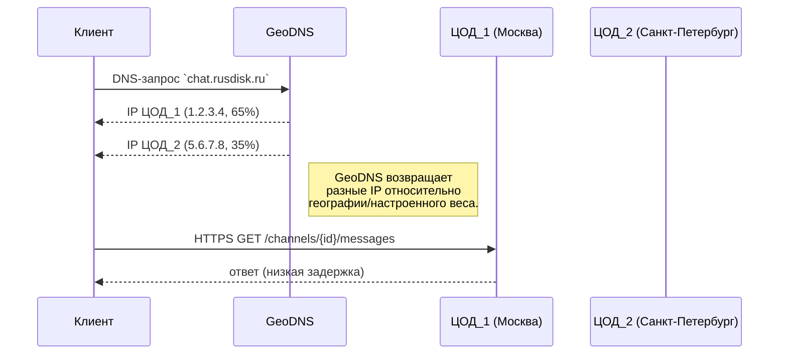
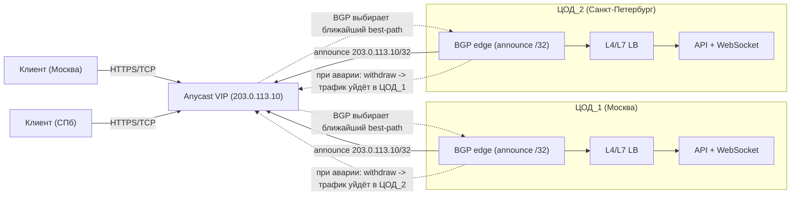

# Highload проект : высоконагруженный чат с разбивкой на Сервера/Гильдии 
  
---
# 1. Описание
## 1.1 Тема и целевая аудитория:

**Тип сервиса :**  B2C чат для больших сообществ.  
**Ключевая модель:** server-based "Гильдия/Сервер -> Канал -> Роль/Разрешение  -> Событие". 
**Реальные аналоги:**  
- Discord (глобальная пользовательская база ~200M+ MAU \[[1](https://discord.com/company)\]).
- Slack (глобальная пользовательская база ~6.4M MAU \[[2](https://slack.com/)\]).
- Microsoft Teams - похожая структура "рабочее пространство ->  каналы", но B2B. (глобальная пользовательская база ~320M MAU \[[3](https://office365itpros.com/2023/10/26/teams-number-of-users-320-million/)\])  
  
**Целевая аудитория Discord**:   
- **MAU(месячные активные пользователи)**: ~200,000,000+ / мес (глобально) \[[4](https://backlinko.com/discord-users)\].
- **DAU(дневные активные пользователи)**: ~26,000,000+ / день (глобально) \[[5](https://www.demandsage.com/discord-statistics/)\].
- Регионы: Северная/Южная Америка + Европа.

**Целевая аудитория Discord в России (на 2024)**:
- **MAU**: ~40,000,000+ / мес человек \[[6](https://www.kommersant.ru/doc/7165779)\] - \[[7](https://worldpopulationreview.com/country-rankings/discord-users-by-country)\] 
- **DAU**: ~4,000,000+ / день человек (10% от MAU, рассчитано по аналогии с Discord \[[1](https://discord.com/company)\])
## 1.2 MVP  - 7 основных функций:

1. **Регистрация/авторизация:** регистрация, вход, управление сессиями (JWT-токены и refresh-token).
2. **Гильдии/Серверы:** создание сервера (гильдии) и вход по инвайту. Список серверов пользователя.
3. **Каналы:** список каналов в сервере, фильтр по правам доступа (роль пользователя).
4. **История сообщений:** постраничная пагинация сообщений канала (GET `/channels/{id}/messages`).
5. **Отправка сообщений:** POST `/channels/{id}/messages` + мгновенная доставка по WebSocket.
6. **Статусы прочтения/упоминания:** отслеживание read/unread и упоминаний (@user) для каждого пользователя.
7. **Роли/Модерация:** создание ролей, настройка прав, бан/мут модераторов, поиск по чатам.

Каждая функция вдохновлена практиками Discord и Slack. 
Например, Discord хранит триллионы сообщений \[[8](https://discord.com/blog/maxjourney-pushing-discords-limits-with-a-million-plus-online-users-in-a-single-server)\] и применяет роли/каналы с ACL.
  
---  
---
# 2. Расчёт нагрузки:
## 2.1 Продуктовые метрики:

- **MAU**: ~40,000,000+ / мес человек \[[6](https://www.kommersant.ru/doc/7165779)\] - \[[7](https://worldpopulationreview.com/country-rankings/discord-users-by-country)\].
- **DAU**: ~4,000,000+ / день человек (10% от MAU, рассчитано по аналогии с Discord \[[1](https://discord.com/company)\]).
- Активных отправителей (_share_communicators_) = 30% \[[9](https://discord.com/community/understanding-server-insights)\] от **DAU** = 1,200,000.
- Сообщений на отправителя (_messages_per_communicator_) = 15/день \[[9](https://discord.com/community/understanding-server-insights)\]. 
- Открытий истории канала на пользователя (_channels_history_open_) = 10 / день \[[9](https://discord.com/community/understanding-server-insights)\].
- Запросов списков каналов/серверов на пользователя (_channels_list_) = 5/день.
### Продуктовые метрики:

| Метрика                     |          Значение |
| --------------------------- | ----------------: |
| **MAU**                     | ~40,000,000 / мес |
| **DAU**                     | ~4,000,000 / день |
| _share_communicators_       |              0.30 |
| _DAU_share_communicators_   |  1,200,000 / день |
| _messages_per_communicator_ |         15 / день |
| _channels_history_open_     |        10  / день |
| _channels_list_             |          5 / день |

## 2.2 RPS (запросов в секунду) по API:

Рассчитаем нагрузки API:
- **GET `/channels/{id}/messages` (история канала):**  
    - _Request_per_day_ = 4,000,000 \* 10  = 40,000,000.  
    - _RPS_average_ = _Request_per_day_ /  86,400 = 40,000,000 / 86,400 = **~463**.
    - _RPS_peak_ = _RPS_average_ \* 10 = **~4630**.
    
- **GET `/me/guilds` + `/guilds/{id}/channels` (списки):**  
    - _Request_per_day_ = 4,000,000 \* 5 = 20,000,000.  
    - _RPS_average_ = _Request_per_day_ /  86,400 = 20,000,000 / 86,400 = **~231**.
	-  RPS_peak = _RPS_average_ \* 10 = **~2310**.
    
- **POST `/channels/{id}/messages` (отправка):**  
    - _Request_per_day_ = 1,200,000 \* 15 = 18,000,000.  
    - _RPS_average_ = _Request_per_day_ /  86,400 = 18,000,000 / 86,400 = **~208**.
    - RPS_peak = _RPS_average_ \* 10 = **~2080**.

| Endpoint     | _Request_per_day_ | _RPS_average_ | _RPS_peak_ |
| ------------ | ----------------: | ------------: | ---------: |
| **История**  |        40,000,000 |           463 |      4,630 |
| **Списки**   |        20,000,000 |           231 |      2,310 |
| **Отправка** |        18,000,000 |           208 |      2,080 |
> Формулы: 
> - _Request_per_day_ = **DAU** \* действия пользователя из статистики Discord
> - _RPS_avg_ = _Request_per_day_ / секунд в дне 
> - _RPS_peak_ = _Request_per_day_ \* десятикратная нагрузка
## 2.3 Внутренние события (fan-out):

Пусть коэффициент fan-out **F = 20** (каждое сообщение получают 20 пользователей \[[10](https://discord.com/blog/how-discord-indexes-trillions-of-messages)\]). Тогда:
- Сообщений/день (в системе): _Request_per_day_ = 1,200,000 \* 15 = **18,000,000**.
- **Доставки WebSocket:** 18,000,000 \* 20 = **360,000,000 / день**.
- **Обновления read-state:** также **360,000,000 / день**..
- _RPS_average_: 360,000,000 / 86,400 = **~4167**.
- _RPS_peak_:  =  4167 \* 10 =  **~41 670**.

| Endpoint                            | _Request_per_day_ | _RPS_average_ | _RPS_peak_ |
| ----------------------------------- | ----------------: | ------------: | ---------: |
| **Доставки по WebSocket (fan-out)** |       360,000,000 |         4,167 |    41, 670 |
| **Обновления read-state**           |       360,000,000 |         4,167 |     41,670 |

> То есть система должна выдерживать тысячи RPS на внутренние события. 
> Это походит на наблюдения Discord Engineering, где fan-out является "hot path" \[[10](https://discord.com/blog/how-discord-indexes-trillions-of-messages)\].

## 2.4 Хранение данных и сеть:
### Хранение:

- **18,000,000** сообщений \* 1 KB = 18 GB / день. Это **~6.5 TB / год** \[[11](https://discord.com/blog/how-discord-stores-trillions-of-messages)\]. 
- При _RF_ (коэффициент/фактор репликации) = 3 - это **~19.5 TB / год**. 
- Учитывая индексы и запасы, оценим хранилище: **~25 TB / год**.

| Endpoint                                     | _В день_ | _В год_ |
| -------------------------------------------- | -------: | ------: |
| **Хранение сообщений**                       |    18 GB |  6.5 TB |
| **Хранение сообщений с фактором репликации** |    54 GB | 19.5 TB |
| **Хранение сообщений с индексами + запасы**  |    70 GB |   25 TB |
### Сеть:
- _Входящий:_ 
	-  _Messages_per_day_ = **18,000,000** 
	- _Bytes_per_day_ = 18,000,000 * 1024 = **18,432,000,000 байт/день**
	- _GiB_per_day_ = Bytes_per_day / (1024 \* 1024 \* 1024) = 18,432,000,000 / 1,073,741,824 = **17.166 GiB/day** 
	- _MiB_per_sec_average_ = $\frac{BytesPerDay}{86400 \cdot 1024 \cdot 1024}$ = **~0.203 MiB/s**
	- _MiB_per_sec_peak_ = 0.203 \* 10 = **~2.03 MiB/s**
- _Исходящий (WebSocket):_ 
	- _Deliveries_per_day_ ​= 18,000,000 \* 20 = **360,000,000**
	- _Bytes_per_day_ = 360,000,000 \* 1024 = **368,640,000,000 B/day**  
	- _GiB_per_day_ = **~343.32 GB/day**. 
	- _MiB_per_sec_average_ = $\frac{BytesPerDay}{86400 \cdot 1024 \cdot 1024}$ = **~4.07 MiB/s**
	- _MiB_per_sec_peak_ = 4.07 \* 10 = **~40.69 MiB/s**

| Endpoint      |    _Ивенты_ |   _Байт в день_ | _Гигабайт в день_ | _Мегабайт в секунду среднее_ | _Мегабайт в секунду пик_ |
| ------------- | ----------: | --------------: | ----------------- | ---------------------------- | ------------------------ |
| **Входящие**  |  18,000,000 |  18,432,000,000 | 17.166            | 0.203                        | 2.03                     |
| **Исходящие** | 360,000,000 | 368,640,000,000 | 343.32            | 4.07                         | 40.69                    |

---
---
# 3. Глобальная балансировка нагрузки
## 3.1 Краткое описание

Система распределяет трафик между **двумя** российскими ЦОД (Москва и Санкт-Петербург) для минимизации задержек и обеспечения отказоустойчивости. Используется актив-активная схема: оба ЦОДа обрабатывают трафик (65% и 35% соответственно). В случае сбоя одного ЦОД весь трафик автоматически переключается на второй.
## 3.2 Функциональное разделение по доменам

| Домен                 | Что делает                     | Где выполняется                                  | Обоснование                                            |
| --------------------- | ------------------------------ | ------------------------------------------------ | ------------------------------------------------------ |
| Идентификация/сессии  | логин, JWT/refresh             | Только в ЦОД (Москва/СПб)                        | Персональные данные + консистентность сессий           |
| Гильдии/каналы/ACL    | список серверов, каналы, права | Чтение: ЦОД (+ кэш в ЦОД), изменения: только ЦОД | Права должны быть актуальными, изменения - строго в БД |
| Сообщения (запись)    | `POST .../messages`            | Только ЦОД                                       | Запись в БД + генерация событий                        |
| Сообщения (чтение)    | `GET .../messages`             | ЦОД, ускорение через кэш в ЦОД                   | источник - БД, но можно кешировать “горячее”           |
| WebSocket / realtime  | WS соединения и доставка       | ЦОД (к ближайшему ЦОД)                           | долгие соединения, sticky-сессии, низкая задержка      |
| Read/unread, mentions | непрочитано, упоминания        | ЦОД, часть - кэш/агрегация в ЦОД                 | счетчики и статусы должны быть корректными             |
| Модерация/роли        | бан/мут/роли                   | Только ЦОД                                       | критично к целостности ACL и аудиту                    |
| Поиск                 | поиск по истории               | ЦОД (поисковый кластер рядом с данными)          | индексы рядом с данными, обновление можно асинхронно   |
## 3.3 Обоснование расположения ЦОД

ЦОД выбраны в Москве и Санкт-Петербурге по географическим и инфраструктурным соображениям:

| Продуктовая метрика                  | Влияние расположения ЦОД (кратко)                                                   |
| ------------------------------------ | ----------------------------------------------------------------------------------- |
| Время доставки сообщения             | Ближайший ЦОД -> меньше RTT для `POST` и быстрее дошло сообщение.                   |
| Стабильность WebSocket               | Ближайшая площадка -> меньше потерь -> меньше разрывов WS.                          |
| Надёжность отправки (write path)     | При падении одного ЦОД второй принимает 100% трафика (failover без простоя).        |
| Консистентность прав/ACL и модерации | Метаданные прав живут в ЦОД; 2 площадки в РФ -> быстрый синк и единые политики.     |
| Скорость открытия каналов/списков    | `GET /me/guilds`, `/guilds/{id}/channels` быстрее за счёт меньшей сетевой задержки. |
| Доступ к истории сообщений           | `GET /channels/{id}/messages` быстрее и стабильнее (меньше таймаутов/ретраев).      |
## 3.3 Распределение запросов по ЦОД

| Эндпоинт                | Запросов/день (МСК) | RPS_average (МСК) | RPS_peak (МСК) | Запросов/день (СПБ) | RPS_average (СПБ) | RPS_peak (СПБ) |
| ----------------------- | ------------------- | ----------------- | -------------- | ------------------- | ----------------- | -------------- |
| История канала          | 26,000,000          | 301               | 3,010          | 14,000,000          | 162               | 1,620          |
| Списки (гильдии/каналы) | 13,000,000          | 150               | 1,501          | 7,000,000           | 81                | 809            |
| Отправка сообщений      | 11,700,000          | 136               | 1,352          | 6,300,000           | 72                | 728            |

## 3.4. Распределение внутренних событий (fan-out, read-state)

| Эндпоинт                     | Событий/день (МСК) | RPS_average (МСК) | RPS_peak (МСК) | Запросов/день (СПБ) | RPS_average (СПБ) | RPS_peak (СПБ) |
| ---------------------------- | ------------------ | ----------------- | -------------- | ------------------- | ----------------- | -------------- |
| WebSocket-доставка (fan-out) | 234,000,000        | 2,708             | 27,080         | 126,000,000         | 1,459             | 14,590         |
| Обновления статуса прочтения | 234,000,000        | 2,708          | 27,080      | 126,000,000         | 1,459          | 14,590      |

## 3.5. Схема DNS-балансировки

Таким образом, пользователи из Москвы чаще получают IP ЦОД_1, из СПб - ЦОД_2. 
При отказе одного IP-сервера можно использовать механизмы failover DNS.

## 3.6. Схема DNS-балансировки

Пользователь из Москвы по Anycast попадёт в `ЦОД_1`, из СПб - в `ЦОД_2` . 
При падении одного ЦОД маршрутизаторы перенаправят запросы на другой автоматически (автоматический failover на IP-уровне\[[12](https://aws.amazon.com/global-accelerator/features/)\]

---
---
# Источники:

1. Discord Inc., _"About Discord"_ (корпоративная страница, 2025): https://discord.com/company
2. Salesforce Inc., "Millions of people love to work in Slack" (корпоративная страница, 2026): https://slack.com/
3. Office 365. Teams Grows to 320 Million Monthly Active Users: https://office365itpros.com/2023/10/26/teams-number-of-users-320-million/.
4. Backlinko. Discord User and Funding Statistics: How Many People Use Discord: https://backlinko.com/discord-users
5. Demandsage. Discord Statistics 2026 (Users, Revenue & Market Share): https://www.demandsage.com/discord-statistics/
6. Коммерсантъ. С Discord сыграли в частичную блокировку: https://www.kommersant.ru/doc/7165779
7. World Population Review. Discord Users by Country 2026: https://worldpopulationreview.com/country-rankings/discord-users-by-country
8. Discord Inc., Maxjourney: Pushing Discord’s Limits with a Million+ Online Users in a Single Server: https://discord.com/blog/maxjourney-pushing-discords-limits-with-a-million-plus-online-users-in-a-single-server
9. Discord Inc., Discord benchmark of 30% communicators as a healthy goal: https://discord.com/community/understanding-server-insights
10. Discord Inc. How Discord Indexes Trillions of Messages: https://discord.com/blog/how-discord-indexes-trillions-of-messages
11. Discord Inc. How Discord Stores Trillions of Messages: https://discord.com/blog/how-discord-stores-trillions-of-messages
12. Amazon Inc. AWS Global Accelerator features: https://aws.amazon.com/global-accelerator/features/