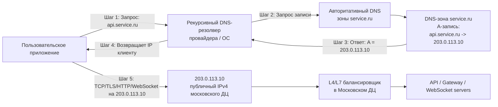

# Высоконагруженный мессенджер-клон Telegram

---
## Содержание

- [Высоконагруженный мессенджер-клон Telegram](#высоконагруженный-мессенджер-клон-telegram)
	- [Содержание](#содержание)
	- [Основная часть](#основная-часть)
		- [1. Тема и целевая аудитория](#1-тема-и-целевая-аудитория)
			- [Функционал MVP](#функционал-mvp)
			- [Аналоги на рынке](#аналоги-на-рынке)
			- [Глобальная аудитория Telegram](#глобальная-аудитория-telegram)
				- [Глобальное распределение по полу](#глобальное-распределение-по-полу)
				- [Глобальное распределение по возрасту](#глобальное-распределение-по-возрасту)
			-  [Аудитория Telegram в России](#аудитория-telegram-в-россии)
			- [География и размер](#география-и-размер)
		- [2. Расчёт нагрузки](#2-расчёт-нагрузки)
			- [Продуктовые метрики](#продуктовые-метрики)
				- [Допущения](#допущения)
			- [Технические метрики](#технические-метрики)
				- [Сетевой трафик в день](#сетевой-трафик-в-день)
				- [Запросы в секунду](#запросы-в-секунду)
				- [Расчеты](#расчеты)
		- [3. Глобальная балансировка нагрузки](#3-глобальная-балансировка-нагрузки)
			- [Расположение дата-центров](#расположение-дата-центров)
			- [Схема DNS балансировки](#схема-dns-балансировки)
			- [Схема Anycast балансировки](#схема-anycast-балансировки)
	- [Список источников](#список-источников)

---
## Основная часть

### 1. Тема и целевая аудитория

**Тип сервиса :**  Мессенджер-клон Telegram для русского рынка.
#### Функционал MVP

1.  Отправка/прием текстовых сообщений.
2. Групповые чаты и каналы (общение больших групп пользователей).
3. Секретные чаты (конфиденциальность сообщений).
4.  Синхронизация сообщений в облаке - все чаты хранятся на сервере (доступны с любого устройства).

#### Аналоги на рынке

- Telegram. Глобальная месячная аудитория ~1,000 млн MAU [^1] и ~500 млн DAU [^1] на 2026 г.
- WhatsApp. Глобальная месячная аудитория ~3,000 млн MAU[^2] и ~600 млн DAU [^10] на 2024 г.

#### Глобальная аудитория Telegram

- **MAU (месячные активные пользователи)**: ~1 000 млн пользователей [^1].
- **DAU (дневные активные пользователи)**: ~500 млн пользователей [^1].
- Страны: Индия, Бразилия, Мексика, Южная Африка, Испания, Италия, Германия, Франция, Россия [^1].
##### Глобальное распределение по полу

| Пол     | Значение (%) |
| ------- | ------------ |
| Мужской | 58.6 % [^4]  |
| Женский | 41.4 % [^4]  |
##### Глобальное распределение по возрасту

| Группа  | Значение (%) |
| ------- | ------------ |
| 13 - 17 | 6.4% [^5]    |
| 18 - 24 | 18.8% [^5]   |
| 25 - 34 | 29.4% [^5]   |
| 35 - 44 | 23.8% [^5]   |
| 45 - 54 | N/A          |
| 55+     | N/A          |

#### Аудитория Telegram в России

- **MAU**: ~34,4 млн человек в месяц. [^3]
- **DAU**: ~17 млн человек в день (При принятом соотношении DAU/MAU ≈ 50%)
- За оценки по полу и возрасту возьмем глобальные метрики.

#### География и размер

**Основной рынок**: Россия. 
Это ~145 млн населения. 34,4 млн MAU Telegram в РФ соответствует примерно 24% населения. Масштабный рынок с высокой нагрузкой.

---
### 2. Расчёт нагрузки
#### Продуктовые метрики

| Метрика                                          | Расшифровка                                                                         | Значение                        | Комментарии       |
| ------------------------------------------------ | ----------------------------------------------------------------------------------- | ------------------------------- | ----------------- |
| MAU                                              | Активных пользователей в месяц                                                   | ~34,400,000 человек в месяц     | нет               |
| DAU                                              | Активных пользователей в день                                                    | ~17,200,000 человек в день      | нет               |
| DSU (Daily  Sessions per User)                | Открытых сессий в день  на пользовтеля                                           | 21 сессия в день [^6]           | см. допущение № 1 |
| DATSU (Daily Average  Time Spent per User)    | Среднее время в день,  которое проводит пользователь в приложении                | 41 минута в день [^6]           | см. допущение № 1 |
| DMR (Daily Messages Received)                    | **Полученных** сообщений в день на всех пользователей                               | ~5,160,000,000 сообщений в день | см. допущение № 2 |
| DAMRU (Daily Average Messages Received per User) | Среднее количество **получаемых** сообщений  в день на одного  пользователя   | ~296.5 сообщений в день      | см. допущение № 3 |
| DMS (Daily Messages Send)                        | **Отправленных** сообщений в день на всех пользователей                             | ~802,724,000 сообщений в день   | cм. допущение № 4 |
| DAMSU (Daily Average Messages Sens per User)     | Среднее количество **отправленных** сообщений  в день на одного  пользователя | ~46.67  сообщений в день     | cм. допущение № 4 |
| MMC (Median Messages Character)                  | Медианное количество символов в 1 сообщении                                         | 136 [^8]                        | нет               |
| DASU (Daily Average Storage per User)            | Среднее количество памяти, которое занимает 1 пользователь в день                   | ~24.79 КБ                       | cм. допущение № 5 |
##### Допущения
1. Далее будут метрики, которые относятся к России. Если конкретно по России нет той или иной метрики, я предполагаю, что глобальная метрика будет иметь похожие значения и в РФ.

2. Данные по сообщениям в день старые (от 2016) [^7]. Но в них говорится, что получается 15,000,000,000 сообщений в день, при глобальном MAU 100,000,000 (на 2016) и DAU 50,000,000[^7] (мы допускаем соотношение DAU/MAU = 0.5, как в 2026). 
   Предположим, что тенденция на получение сообщений не снизилась. Мое предположение базируется на широком распространении ботов и развития большого количества сообществ в Telegram. Учитывая, что глобальное MAU теперь 1,000,000,000 и DAU 500,000,000[^1]. Полученных сообщений в день должно быть 150,000,000,000. Посчитаем коэффициент соотношения глобального DAU к Российскому DAU: $500,000,000 ÷ 17,200,000 = 29.07$. 
   Количество получаемых сообщений в день на всех пользователей России: $150,000,000,000 ÷ 29.07 =\ \sim5,160,000,000$ 

3. Учитывая, что пользователем может быть Бот, через которого проходит огромное количество сообщений.

4. Telegram не публикует количество отправленных сообщений в день, поэтому сделаем предположение, что их столько же, как и в WhatsApp. При ~3,000,000,000 MAU[^2] и ~600,000,000 DAU [^10] и более ~40,000,000,000 сообщений в день [^11].  
   Получаем примерно: $40,000,000,000 ÷ 600,000,000 =\ \sim66.67$ сообщений в день.
   Но учтем, что Telegram больше, чем мессенджер и люди тратят 30% времени **только** [^12] на чтение каналов, получим оценку: $66.67 \times (1 \times 0.30) =\ \sim 46.67$ в день на одного пользователя.
   Или в день по всем пользователям России получим $46.67 \times 17,200,000  =\ \sim 802,724,000$.

5.  Размер одного сообщения: $136 \times 4 = 544$ байта, так как мы берем за основу кодировку UTF-8 с поддержкой русских символов и смайликов [^9]. И соответственно, хранилища, нужного в день на одного пользователя: $544 \times 46.67 = 25,387$ байт или  $\sim 24.79$  КБ.

#### Технические метрики
##### Сетевой трафик в день

| Тип трафика                          | Суточный объём (ГБ/сут) | Средняя скорость (Гбит/с) | Пиковая скорость (Гбит/с) | Расчеты   |
| ------------------------------------ | ----------------------- | ------------------------- | ------------------------- | --------- |
| Исходящие  текстовые сообщения    | 436.68 ГБ/сут           | 0.0404 Гбит/с             | 0.1617 Гбит/с             | № 2, 3, 4 |
| Входящие  текстовые сообщения  | 2807.04 ГБ/сут          | 0.2599 Гбит/с             | 1.0396 Гбит/с             | № 5, 6, 7 |
| **Всего**                            | 3243.72 ГБ/сут          | 0.3003 Гбит/с             | 1.2013 Гбит/с             |           |

##### Запросы в секунду

| Тип запроса       | Расшифровка        | Среднее RPS | Пиковое RPS | Расчеты  |
| ----------------- | ------------------ | ----------- | ----------- | -------- |
| SendMessages      | Отправка сообщений | 9,291       | 37,163      | № 8, 9   |
| DeliveredMessages | Доставка сообщений | 59,722      | 238,889     | № 10, 11 |
| GetUpdates        | Синхронизация      | 4,181       | 16,722      | № 12, 13 |

##### Расчеты

1. Берем распределение сообщений по часам [^13] на мессенджер. Видим что пиковый рост трафика от минимальных значений может быть в 4 раза и судя по распределению держаться довольно долго, значит  $k_{peak}= 4$.
2.  _Суточный объём (ГБ/сут)_: $V_{day}=\dfrac{DMS \cdot S_{msg}}{10^9}$, $S_{msg}=MMC\cdot4=136\cdot4=544\ \text{Б}$, $DMS=802,724,000$, тогда $V_{day}=\dfrac{802,724,000\cdot544}{10^9}=436.68\ \text{ГБ/сут}$
3. _Средняя скорость (Гбит/с)_: $V_{avg}=\dfrac{DMS \cdot S_{msg}\cdot 8}{86,400\cdot10^9}$, $V_{avg}=\dfrac{802,724,000\cdot544\cdot8}{86,400\cdot10^9}=0.0404\ \text{Гбит/с}$
4. _Пиковая скорость (Гбит/с)_: $V_{peak}=k_{peak}\cdot V_{avg}$, $k_{peak}=4$, $V_{peak}=4\cdot0.0404=0.1617\ \text{Гбит/с}$
5.  _Суточный объём (ГБ/сут)_: $V_{day}=\dfrac{DMR\cdot S_{msg}}{10^9}$, $S_{msg}=MMC\cdot4=136\cdot4=544\ \text{B}$, $DMR=5,160,000,000$, тогда $V_{day}=\dfrac{5,160,000,000\cdot544}{10^9}=2807.04\ \text{ГБ/сут}$
6. _Средняя скорость (Гбит/с)_: $V_{avg}=\dfrac{DMR\cdot S_{msg}\cdot 8}{86,400\cdot10^9}$, $V_{avg}=\dfrac{5,160,000,000\cdot544\cdot8}{86,400\cdot10^9}=0.2599\ \text{Гбит/с}$
7. _Пиковая скорость (Гбит/с)_: $V_{peak}=k_{peak}\cdot V_{avg}$, $k_{peak}=4$, $V_{peak}=4\cdot0.2599=1.0396\ \text{Гбит/с}$
8. _Среднее RPS_: $RPS_{avg}=\dfrac{DMS}{86,400}=\dfrac{802,724,000}{86,400}=9,290.79\ \approx 9,291$
9. _Пиковое RPS_: $S_{peak}=k_{peak}\cdot RPS_{avg}=4\cdot 9,290.79=37,163.16\ \approx 37,163$
10. _Среднее RPS_: $RPS_{avg}=\dfrac{DMR}{86,400} =\dfrac{5,160,000,000}{86,400}=59,722.22\ \approx 59,722$
11. _Пиковое RPS_: $RPS_{peak}=k_{peak}\cdot RPS_{avg} =4\cdot 59,722.22=238,888.89\ \approx 238,889$
12. _Среднее RPS_: $RPS_{avg}=\dfrac{DAU\cdot DSU}{86,400} =\dfrac{17,200,000\cdot21}{86,400}=\dfrac{361,200,000}{86,400}=4,180.56\ \approx 4,181$
13. _Пиковое RPS_: $RPS_{peak}=k_{peak}\cdot RPS_{avg} =4\cdot4,180.56=16,722.22\ \approx 16,722$

---
### 3. Глобальная балансировка нагрузки

#### Функциональное разбиение по доменам

Сервис мессенджера обычно разбивается на несколько доменов, каждый может развёртываться в каждом ДЦ:

| Домен                           | Описание                                                                     |
| ------------------------------- | ---------------------------------------------------------------------------- |
| API/Frontend                    | Приём запросов от клиентов (HTTP/WebSocket)                                  |
| Аутентификация (Auth)           | Вход/регистрация, хранение учётных записей                                   |
| Чат/Сообщения (Message)         | Маршрутизация текстовых сообщений. Включает в себя обработка доставки (push) |
| Хранение сообщений (DB/Storage) | базы данных сообщений и метаданных (кластер NoSQL/SQL)                       |
| Мониторинг и логирование        | Сбор метрик, логов.                                                          |

Каждый из этих сервисов может быть клонирован в разные дата-центры  для отказоустойчивости и близости к пользователю.
#### Расположение дата-центров

Так как наш сервис является заменой Telegram в России, нагрузку только этой страны мы и будем рассматривать.
Будем рассматривать регионы с самой большой плотностью населения. Само население нашей страны возьмем как 143,400,000 [^14].
Так же в России примерно 25% населения сосредоточено в 16 городах-миллионниках (большая часть находится в западной части) [^15]

Так же взглянем на распределение населения по регионам:

Вырисовывается четкая картина, что чем ближе к центру, тем плотнее население.

Карта магистральных сетей связи также играет большую роль при определении локации для дата-центра. Чтобы уменьшить задержку при использовании сервиса, будем располагать дата-центры вблизи больших магистральных сетей связи.

Полную интерактивную карту можно найти найти по ссылке [^16].
А так же для полноты аналитики составим сводную таблицу по пингу из Москвы [^17].

| Город           | Средний пинг (мс) | Население  |
| --------------- | ----------------- | ---------- |
| Москва          | локально          | 12,712,305 |
| Новосибирск     | ~5.8              | 1,701,510  |
| Санкт-Петербург | ~8                | 5,581,707  |
| Омск            | ~13.9             | 1,180,677  |
| Уфа             | ~33.3             | 1,146,786  |
| Нижний Новгород | ~56.3             | 1,250,302  |
| Екатеринбург    | ~58.4             | 1,532,970  |
| Казань          | ~56.7             | 1,296,232  |
| Красноярск      | ~64.9             | 1,173 ,095 |
| Челябинск       | ~92.1             | 1,243,883  |
| Ростов-на-Дону  | ~70.2             | 1,139, 641 |
| Пермь           | ~50.0             | 1, 084,120 |
| Краснодар       | ~68.7             | 1,010,552  |

По всем данным, напрашивается два дата-центра, один в Москве, другой в Новосибирске.
Но в рамках MVP мы реализуем только дата-центра в Москве.

#### Схема DNS балансировки

Клиент сначала запрашивает у DNS адрес `api.service.ru`, получает A-запись с публичным IPv4 московского дата-центра, после чего устанавливает соединение с этим адресом. Далее входной L4/L7-балансировщик внутри дата-центра распределяет трафик.

#### Схема Anycast балансировки

Трафик направляется на единый Anycast IP-адрес сервиса, который маршрутизируется в Московский дата-центр. Внутри дата-центра запросы принимаются балансировщиком нагрузки и распределяются между доменами.

---
## Список источников

[^1]: [Telegram Users Statistics 2026 (Latest Global Data)](https://www.demandsage.com/telegram-statistics/)

[^2]: [Number of monthly active WhatsApp users worldwide from April 2013 to March 2025](https://www.statista.com/statistics/260819/number-of-monthly-active-whatsapp-users/)

[^3]: [Telegram Users by Country 2026 (Global Data) | Resourcera](https://resourcera.com/data/social/telegram-users/)

[^4]: [Telegram Users by Country 2026](https://worldpopulationreview.com/country-rankings/telegram-users-by-country)

[^5]: [Telegram Statistics By Active Users, Revenue, Demographics And Facts](https://electroiq.com/stats/telegram-statistics)

[^6]: [Пост из telegram Павла Дурова (2025)](https://t.me/durov/404#)

[^7]: [15 миллиардов сообщений в день. Блог Telegram](https://telegram.org/blog/15-billion)

[^8]: [WhatsApp, Doc? A First Look at WhatsApp Public Group Data](https://gvrkiran.github.io/content/whatsapp.pdf)

[^9]: [UTF-8](https://en.wikipedia.org/wiki/UTF-8)

[^10]: [Number of WhatsApp Business daily active users (DAU) worldwide from 1st quarter 2019 to 3rd quarter 2025](https://www.statista.com/statistics/1538345/whatsapp-business-dau-worldwide/)

[^11]: [How WhatsApp Handles 40 Billion Messages Per Day](https://blog.bytebytego.com/p/how-whatsapp-handles-40-billion-messages#:~:text=WhatsApp%20is%20one%20of%20them%2E%20It%20moves%20nearly%2040%20billion%20messages%20daily)

[^12]: [В Mediascope отметили, что россияне тратят около 30% времени в Telegram на чтение каналов](https://tass.ru/obschestvo/19286563)

[^13]: [Analyzing WhatsApp communication behavior before, during, and after the COVID-19 lockdown. Page 5. Fig 5.](https://www.nature.com/articles/s41599-022-01161-0.pdf)

[^14]: [Население России](https://www.worldometers.info/ru/%D0%BD%D0%B0%D1%81%D0%B5%D0%BB%D0%B5%D0%BD%D0%B8%D0%B5-%D0%BC%D0%B8%D1%80%D0%B0/%D1%80%D0%BE%D1%81%D1%81%D0%B8%D1%8F-%D0%BD%D0%B0%D1%81%D0%B5%D0%BB%D0%B5%D0%BD%D0%B8%D0%B5/)

[^15]: [List of cities and towns in Russia by population](https://en.wikipedia.org/wiki/List_of_cities_and_towns_in_Russia_by_population#:~:text=stand,of%20the%20country%27s%20total%20population)

[^16]: [Магистральные сети связи в России](https://www.comnews.ru/content/211042/2020-10-21/2020-w43/magistralnye-seti-svyazi-rossii)

[^17]: [Пинг из Москвы](netpoint-dc.com/blog/wp-content/uploads/2018/09/NetPoint-Russia.pdf#:~:text=Россия%2C Новосибирск%2C север Ошибка%3A не,188 OK 13%2C54 14%2C21 13%2C85)
